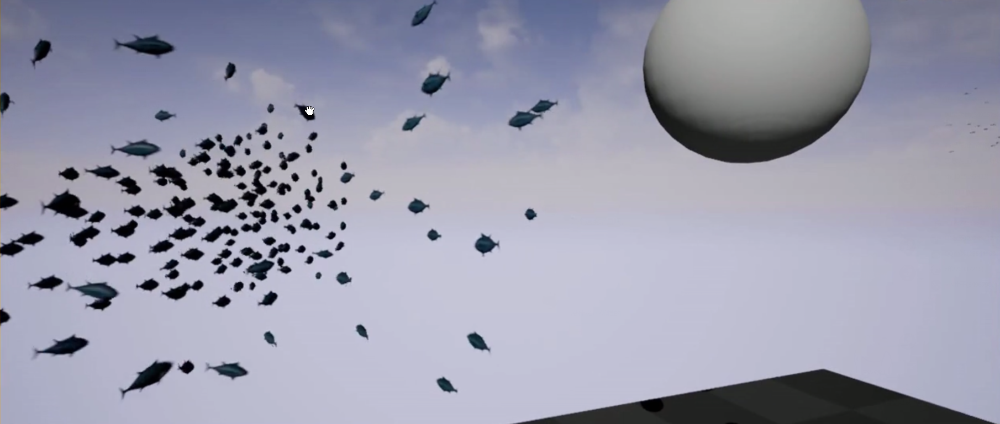
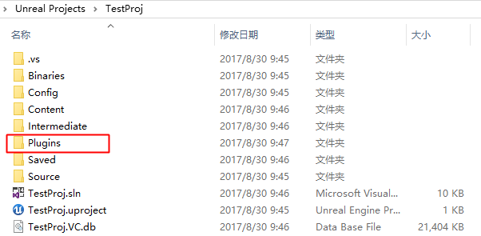
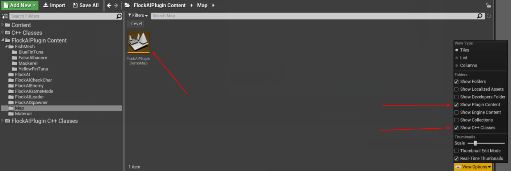
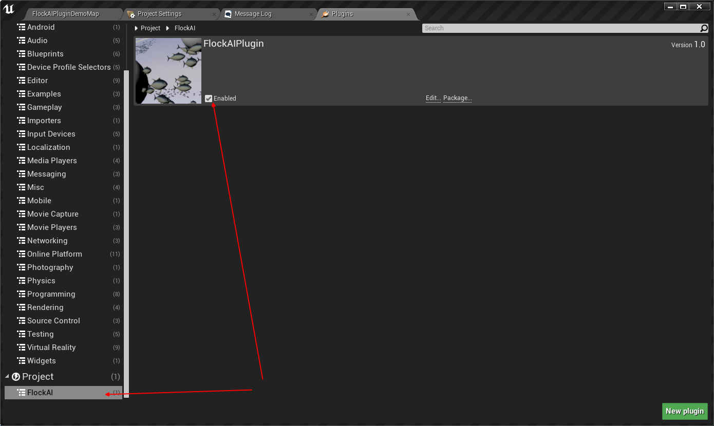

A fish flock AI Plugin for Unreal Engine 4
一个基于虚幻4的鱼群 AI 插件

this Plugin version can Run **2000+** fishes at the same time
这个插件版本可以同时运行 **2000+** 条鱼儿

源码已放到[**GitHub**](https://github.com/no5ix/fish)

# Download

[MyFish.exe (Win64)](https://pan.baidu.com/s/1ghnKNjt)

This is packaged by an unoptimized version( check out  branch old_demo)
下载一个打包好的试玩看看, 这个包是没有经过优化过的版本打包出来的( 是用old_demo分支的版本打包的 )

# Video Preview 

Watch the [Video Preview](http://v.youku.com/v_show/id_XMTc2NTM4MjkyMA==.html)
查看 [**视频演示**](http://v.youku.com/v_show/id_XMTc2NTM4MjkyMA==.html)

# How to play

- *VR* : 

	*(My Device is HTC Vive)*

	* Motion Controller FaceButton1 => Move forward
	 手柄圆盘上键                  => 往前移动

	* PC's KeyBoard Arrow UP and Down    => Move faster or slower
	 电脑键盘的上下箭头键          =>  调整移动速度

	* Hold Motion Controller Trigger Down     => Attract fishes
	 按住手柄扳机键                    => 吸引鱼群

- *PC* :

	* EQ        =>  Up & Down
	 EQ  键     =>  上下 

	* WASD         =>  Basic movement 
	 WASD 键     =>  基本的移动指令(前后左右) 

	* Hold Left Mouse Button Down  =>  Attract fishes
	 按住鼠标左键           =>  吸引鱼群

	* Arrow UP and Down  =>  Move faster or slower
	 上下箭头键         =>  调整移动速度

# How to use

place Plugins folder in your project root directory, then just like
把Plugins文件夹放在你项目的根目录, 接下来如图

# About This 

* Unreal Engine Version

	4.15

* Read [Craig Reynolds's thesis](http://www.red3d.com/cwr/boids/)  
查看 **Craig Reynolds的论文**

* This project implements a new flocking Ai algorithm, with 3 components : 

	> 算法简要

	* Separation : every fish will try to steer away from their neighbors 
	分离性 ：每条鱼都会与周围的鱼保持距离 

	* Following the leader : every fish will try to follow its leader
	跟随一个领头者 ： 每条鱼都会跟随一个领头者

	* Avoiding enemies.
	躲避敌人

